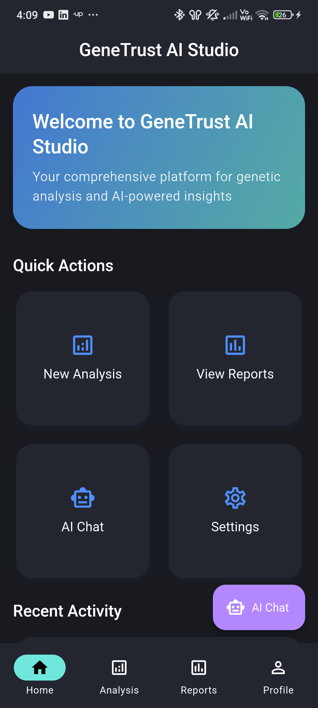
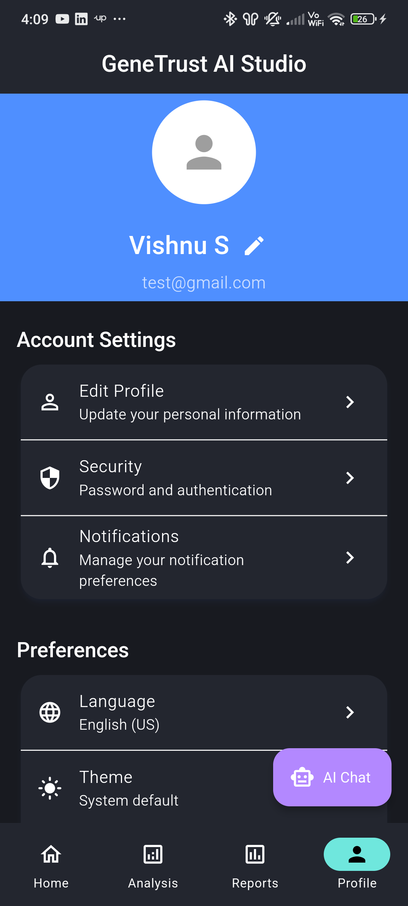
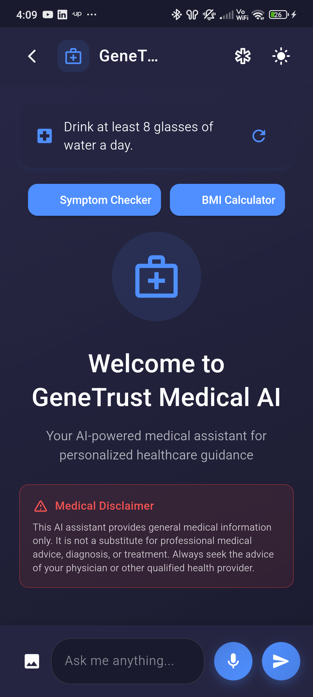
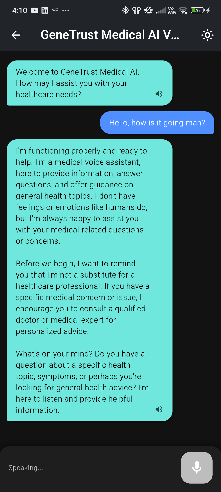

<div align="center">
  
  <br/>
  <b>This project was built for the <span style="color:#4285F4">Code The Cloud: CCD Edition Hackathon</span>.</b>
</div>

---

# GeneTrust Medical AI 🚀

**Your AI-powered medical assistant for everyone!**

---

## 🏆 Hackathon Submission: GeneTrust Medical AI

### 👩‍⚕️ The Problem
Medical information is complex and often inaccessible. Patients and clinicians need instant, reliable, and understandable medical guidance, but jargon and lack of context create confusion and anxiety.

### 💡 Our Solution
**GeneTrust Medical AI** is a Flutter app (with web support) that uses advanced AI to provide:
- Instant medical Q&A and explanations
- Voice-based medical assistant
- Health tips and wellness reminders
- Symptom checker and BMI calculator
- All with a modern, accessible UI and privacy-first design

---

## ✨ What Makes GeneTrust Medical AI Stand Out?
- **Conversational Medical AI:** Ask anything about health, symptoms, or medical terms—get clear, friendly answers.
- **Voice Assistant:** Speak your questions and get spoken answers, hands-free.
- **Health Tips:** Daily rotating health and wellness tips.
- **Symptom Checker:** Select symptoms and get general information (with disclaimers).
- **BMI Calculator:** Quick, easy BMI calculation and advice.
- **Firebase Auth:** Secure sign-in for personalized experience.
- **Web & Mobile:** Deployable to Firebase Hosting for instant web access.
- **Modern UI:** Clean, responsive, and accessible for all users.

---

## 🎥 Quick Demo
1. **Sign in** (or use guest mode)
2. **Try the AI Chat**: Tap "AI Chat" on the home screen
3. **Ask a medical question** or use the voice assistant
4. **Check health tips, use the symptom checker, or calculate BMI**
5. **See instant, AI-powered medical guidance!**

> _Screenshots and demo video can be found in the `/demo` folder_

---

## 🛠️ Features At a Glance
- Medical AI chat (text and voice)
- Health tips carousel
- Symptom checker
- BMI calculator
- Firebase authentication
- Responsive Flutter UI (web & mobile)
- Riverpod state management
- No backend required for AI
- Loading indicators and error messages

---

## 🧑‍💻 Tech Stack
- **Flutter** (UI, web & mobile)
- **Dart** (Logic)
- **Firebase Core & Auth & Hosting**
- **Google Gemini AI API** (for AI chat)
- **Riverpod**

---

## 🏗️ Architecture


> The GeneTrust+ architecture leverages Flutter, Google Cloud, Gemini AI, Firebase Auth, Firestore, and App Check for a secure, scalable, and intelligent medical assistant experience.

### **How it works:**
- **Flutter App** runs on web and mobile, providing a modern UI.
- **Firebase Auth** secures user sign-in and personalization.
- **Firestore** (optional) can store user data, chat history, or logs.
- **Google Gemini AI API** powers the medical AI chat and voice assistant.
- **Text-to-Speech/Speech-to-Text** enables voice interaction.
- **Firebase Hosting** serves the web app to users instantly.

## 🌟 Featured Screens

### 🏠 Home: GeneTrust AI Studio Dashboard


> **Your launchpad for genetic analysis and AI-powered insights.**<br>
> Quick Actions let you start a new analysis, view reports, chat with AI, or access settings—all in one modern, intuitive dashboard.

---

### 👤 Profile: Personalized & Secure (Firebase-backed)


> **Manage your account, security, and preferences with ease.**<br>
> Edit your profile, update security settings, manage notifications, and choose your language or theme. All data is securely managed with Firebase Auth and Firestore.

---

### 💬 Gemini-Powered AI Chat


> **Chat with GeneTrust Medical AI for instant, evidence-based medical guidance.**<br>
> Ask questions, get health tips, and receive friendly, professional answers—always with a clear medical disclaimer. Powered by Google Gemini AI.

---

### 🎤 AI-Powered Voice Chat


> **Talk to your medical AI assistant hands-free!**<br>
> Speak your health questions and get spoken answers. Gemini AI powers the conversation, while the app reads responses aloud for accessibility and convenience.

---

## 🩺 Features (Detailed)

### 1. **Medical AI Chat**
- Ask any medical question in natural language.
- Get clear, friendly, evidence-based answers.
- Medical disclaimers and safety reminders are always included.
- Handles symptoms, conditions, medications, and general health queries.

### 2. **Voice Medical Assistant**
- Speak your questions and get spoken answers.
- Uses advanced speech-to-text and text-to-speech for hands-free interaction.
- Ideal for accessibility and on-the-go use.

### 3. **Health Tips Carousel**
- Rotating daily health and wellness tips at the top of the chat.
- Tips cover hydration, sleep, nutrition, exercise, and more.
- Designed to encourage healthy habits.

### 4. **Symptom Checker**
- Select symptoms from a list and get general information or possible causes.
- Always includes a disclaimer: not a diagnosis, consult a professional.
- Helps users understand when to seek care.

### 5. **BMI Calculator**
- Enter height and weight to get your BMI and a health category.
- Provides instant feedback and general advice.

### 6. **Firebase Authentication**
- Secure sign-in with Google or email.
- Personalizes the experience and can enable saving chat history.

### 7. **Web & Mobile Support**
- Runs on any device: Android, iOS, or web browser.
- Deployed via Firebase Hosting for instant access.

### 8. **Modern, Accessible UI**
- Clean, responsive design for all users.
- Dark/light mode, animations, and accessibility features.

### 9. **Privacy-First**
- No sensitive data stored without user consent.
- All AI queries are anonymized and secure.

---

## 🚀 Try It Yourself (Setup & Web Deployment)

1. **Clone the Repo**
   ```sh
   git clone https://github.com/vishnu252005/genetrust.git
   cd genetrust
   ```
2. **Install Dependencies**
   ```sh
   flutter pub get
   ```
3. **Firebase Setup**
   - Add your Firebase project and config files (`google-services.json`/`GoogleService-Info.plist`)
   - Enable Firebase Auth
   - (For web) Set up Firebase Hosting: `firebase init hosting` and set public dir to `build/web`
4. **AI API Setup**
   - Get your API key from [Google AI Studio](https://makersuite.google.com/app/apikey)
   - Paste it in `lib/services/servicegemini.dart` or the appropriate config file
5. **Build for Web**
   ```sh
   flutter build web
   ```
6. **Deploy to Firebase Hosting**
   ```sh
   firebase deploy
   ```
7. **Run the App Locally**
   ```sh
   flutter run
   ```

---

## 🙌 Thank You, Judges!
GeneTrust Medical AI is about making healthcare more understandable and accessible for everyone. We hope you enjoy trying it as much as we enjoyed building it!

---

## 🚧 The Journey & Challenges

Building GeneTrust+ was not just about writing code—it was a true adventure in cloud, AI, and teamwork. We faced our share of tough moments:

- **Cloud Integration Hurdles:** Setting up secure, real-time connections between Flutter, Firebase, and Gemini AI was a challenge. We wrestled with API limits, authentication quirks, and the ever-changing landscape of cloud services. Debugging cross-platform issues and ensuring data privacy required patience and creativity.
- **AI & UX Balance:** Making advanced AI feel friendly, safe, and accessible for all users took many iterations. We worked hard to ensure every answer was clear, helpful, and always included the right disclaimers.
- **Teamwork & Learning:** We learned to communicate, adapt, and support each other—especially when things broke at the worst possible time!

But every late-night bug, every cloud error, and every "aha!" moment made us stronger. We're proud to have built a platform that empowers users to understand their health, ask questions, and get instant, trustworthy answers—anytime, anywhere.

**GeneTrust+ is more than an app. It's a mission to make healthcare knowledge accessible, safe, and human.**

---


